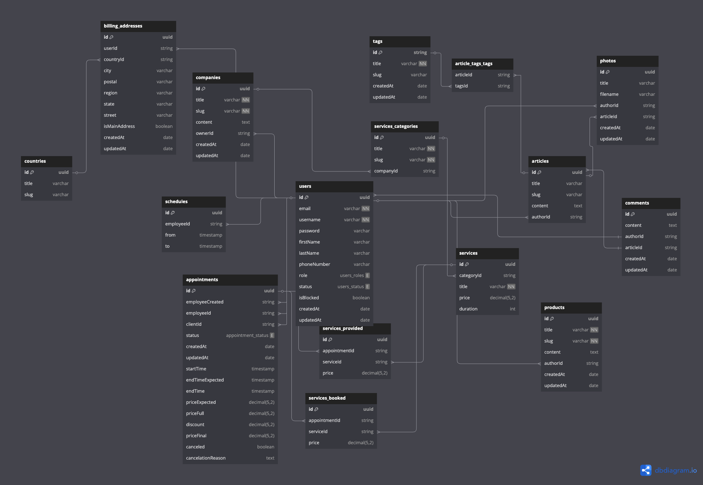
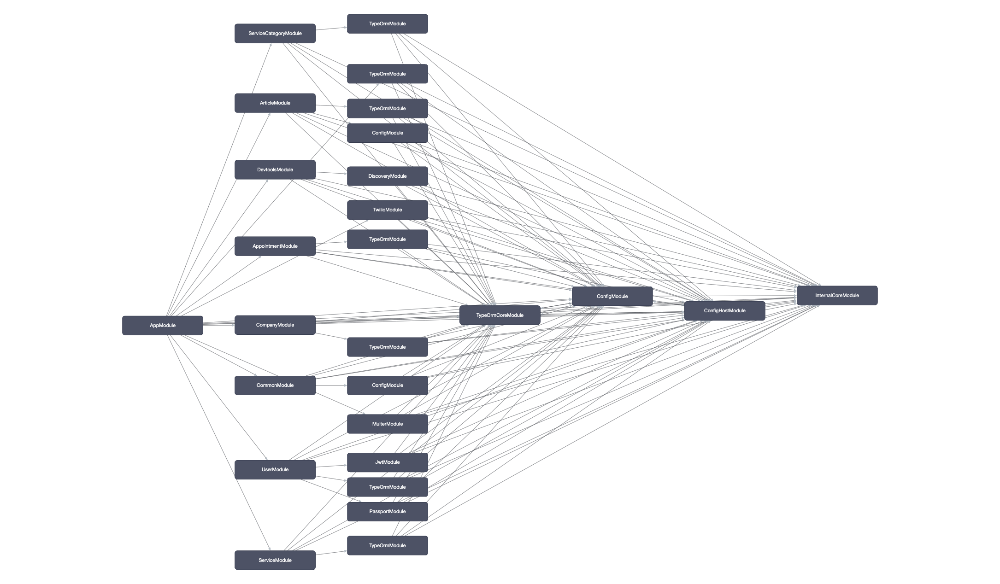

<p align="center">
  <a href="http://nestjs.com/" target="blank"></a>
</p>

## Current status

**Work in progress** - pre-alpha stage!!! Back on track after short break, moving from NestJS v7 to 11.x

## Description

Rest API application for PlanWEAR (Manage appointments & organize schedules), build in [Nest](https://github.com/nestjs/nest) framework.

## Database Structure

**Work in progress** - nothing final yet, nightly tweaks are made!!! Diagram may not represent current entities model.



## Project Graph [Modules]



## External services

PlanWEAR application will be used [Twilio](https://www.twilio.com/) external communication API as SMS provider. The following environmental variables are required:

- TWILIO_ACCOUNT_SID
- TWILIO_AUTH_TOKEN

If you don't want register Twilio account right now, you may want to remove/comment following block of code in src/app.module.ts:

```typescript
    TwilioModule.forRootAsync({
      useFactory: (configService: ConfigService) => ({
        accountSid: configService.get('TWILIO_ACCOUNT_SID'),
        authToken: configService.get('TWILIO_AUTH_TOKEN'),
      }),
      inject: [ConfigService],
    }),
```

Important: Twilio credentials, while not neccessary needed at the moment, **will be required** in near future.

## Entities

[x] Abstract (extends other entities with id [uuid], createdAt & updatedAt fields)  
[x] Appointment  
[x] Article  
[x] BillingAddress  
[x] Comment  
[x] Company  
[x] Country  
[x] Event  
[x] Photo  
[x] ProductCategory  
[x] Product  
[x] Schedule  
[x] ServiceCategory  
[x] ServicesBooked  
[x] ServicesProvided  
[x] Service  
[x] Tag  
[x] Token  
[x] User  

## Migrations

Not set-up yet, work in progress. TypeORM synchronize option is set to true - development mode ONLY, not suited for production!!!

## Installation

```bash
$ pnpm install
```

## Docker

```bash
$ docker-compose up -d
```

## Stay in touch

Author - lukasz [dot] skowron [at] gmail.com
